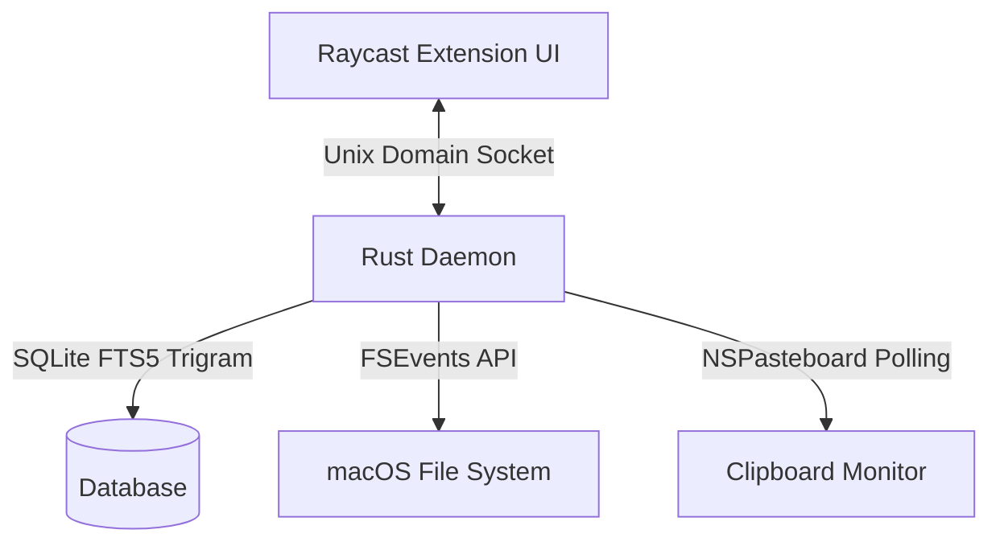

# qfinder — Technical Architecture & Design Guide

Qfinder is a sub-10ms file, clipboard, and note search system for macOS. It bypasses the rendering overhead and indexing latency of native tools (like Finder or Spotlight) by pairing a lightweight Rust daemon within Raycast.

---

## 🏛️ System Architecture

Qfinder is designed as a split-process system separating the **indexing/daemon logic** from the **UI layer**.



### 1. The Core Components
*   **Raycast Extension (TypeScript/React):** Serves as a zero-latency presentation layer. It captures user keystrokes in real-time, sends raw queries across a Unix socket, and renders highly-performant list views with preview details.
*   **Rust Daemon (`qfinder-daemon`):** A long-running background process managed by `launchd` that coordinates file monitoring, clipboard polling, and query handling.
*   **SQLite FTS5 Trigram Database:** A specialized SQLite database utilizing Full-Text Search (FTS5) to store and query indexed items within milliseconds.

---

## ⚡ Indexing & Storage Engine

At the heart of Qfinder's speed is a localized index structured to allow fast partial matches on large datasets.

### Database Schema
Items are kept in a flat SQLite table optimized for quick insertions and heavy indexing:
```sql
CREATE TABLE items (
    id TEXT PRIMARY KEY,
    path TEXT UNIQUE,
    name TEXT,
    type TEXT, -- 'file', 'note', 'clipboard', 'image', 'video', 'pdf'
    updated_at INTEGER
);
```

To support rapid partial name matching (e.g. matching `cv` to `spass_cv.pdf`), Qfinder leverages **SQLite's FTS5 engine** with a **Trigram tokenizer**. Trigram indexes split strings into 3-character slices, allowing instant queries on arbitrary substrings without resorting to slow linear scans.

---

## 🔍 Search Strategy & Query Pipeline

When a user types a query, Qfinder processes it through a multi-stage fallback pipeline to ensure relevant matches are never missed, even with typos or special characters.


### easy search normalization
Special delimiters such as dashes (`-`) and underscores (`_`) are normalized into standard spaces. This ensures that a query like `my-file` successfully pairs with files containing `my_file` or `myfile`.

### lazy matching 
lower lvl only if higher lvl fails
1.  **FTS5 Trigram Match:** The query is tokenized, joined with `AND` operators, and run against the FTS5 virtual table.
2.  **Longest Token LIKE:** If FTS5 yields no results, the engine identifies the longest word in the query and executes an SQL `LIKE '%token%'` query.
3.  **Levenshtein Distance:** As a last resort, results are parsed through a Levenshtein edit-distance filter to allow fuzzy-match recovery for typo correction.

---

## System Integration & IPC

### Unix Domain Socket (UDS) Protocol
IPC takes place over a high-speed Unix Domain Socket located at `~/.qfinder/socket.sock`.
*   **Payload Format:** Packets are standard JSON objects prefixed with a 4-byte **big-endian** length header representing the message size.
*   **Lifecycle Stability:** To prevent launchd service deadlocks, the daemon programmatically clears stale socket descriptors (`rm -f socket.sock`) before binding.

### macOS APIs Leveraged
*   **FSEvents API:** Subscribes to kernel-level directory changes to update the file index live when files are created, renamed, or deleted.
*   **NSPasteboard API:** Interacts with the macOS system clipboard.
    *   *Implementation Note:* To access AppKit's `NSPasteboard` inside a headless Rust environment, the daemon explicitly links to AppKit:
        ```rust
        #[link(name = "AppKit", kind = "framework")] 
        extern "C" {}
        ```

---

## 🛠️ Development & Deployment

### Building the Daemon (Rust)
To compile the high-performance release binary manually:
```bash
cd daemon
cargo build --release
```

### Developing the Extension (Raycast)
To run the Raycast UI in developer mode with live-reload support:
```bash
cd extension
bun install
bun run dev
```

To compile a production build of the extension:
```bash
cd extension
ray build
```